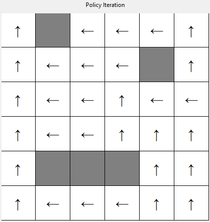

# sc4003-assignment-1
## Overview

This project is the first assignment for the SC4003 Intelligent Agents course. It involves implementing value iteration and policy iteration algorithms to solve a maze environment. The goal is to find the optimal policy and utilities for all non-wall states in the maze.

## Installation
Python version: 3.11.5

1. Create a virtual environment (`python3 -m venv venv`)
2. Activate virtual environment (`source venv/bin/activate`)
3. Install dependencies (`pip install -r requirements.txt`)

## How to Run

- To run code for part 1 (`python3 part1.py`)
- To run code for part 2 (`python3 part2.py`)

## Results

The following section presents the optimum policy and final utilities found by value iteration, policy iteration and modified iteration.

### Maze

The original maze looks like this:

### Optimum Policy

Value iteration policy and utility:

Policy                     |  Utility
:-------------------------:|:-------------------------:
  |  

Policy iteration policy and utility:

Policy                     |  Utility
:-------------------------:|:-------------------------:
  |  

Modified policy iteration policy and utility:

Policy                     |  Utility
:-------------------------:|:-------------------------:
  |  
